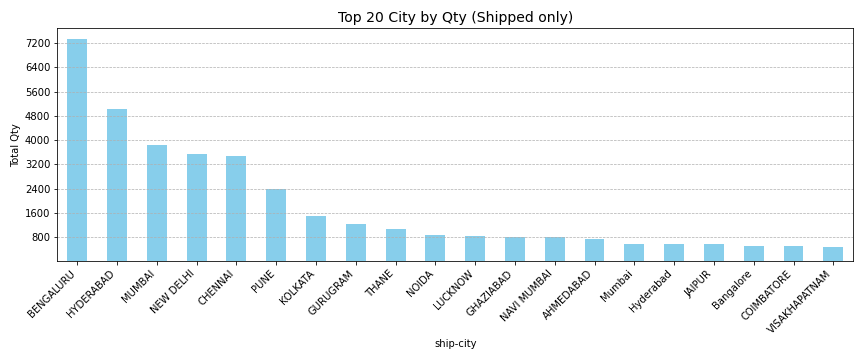
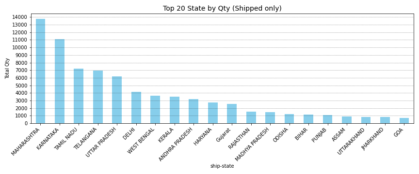
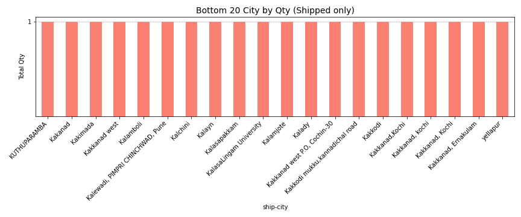
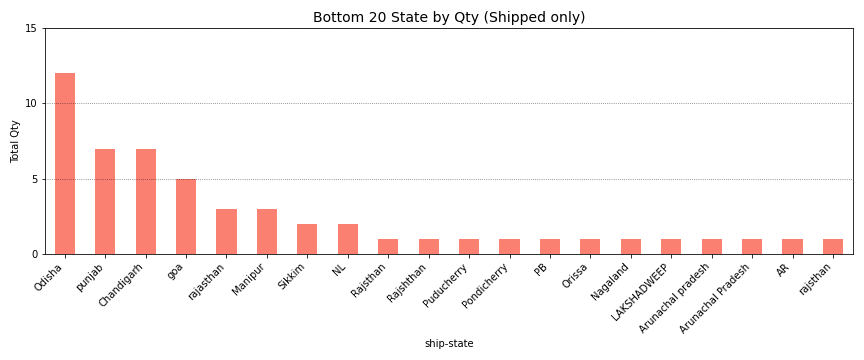
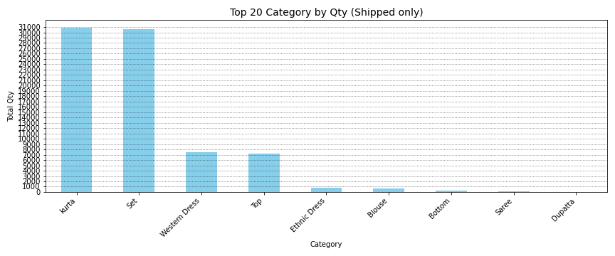

# 📊 E-commerce Sales Analysis

**Analyzing sales trends to identify bestsellers and weak performers, and uncover strategies for improvement.**

---

## 📌 Project Overview

This project focuses on analyzing sales data from an e-commerce platform to:

- Identify **top-selling products** (`Shipped` status)
- Visualize **unpopular items**
- Understand sales trends by category, size, city, and promotion
- Suggest potential improvement strategies

I am using **Python**, specifically **Jupyter Notebook** and **VSCode**, for data analysis and visualization.

---

## 🔍 Dataset

- **Source**: [Amazon Sale Report](https://www.kaggle.com/datasets) on Kaggle
- **Records**: 77,804 rows (after filtering `Shipped`, 77,596 used)
- **Key Columns**:
  - `SKU`, `Category`, `Qty`, `Status`, `Size`, `ship-city`, `promotion-ids`, etc.

---

## 🧹 Data Cleaning & Filtering

- Filtered by: `Status == 'Shipped'`

- **Dropped Rows**: Removed rows with missing values in both `Currency` and `Amount` columns, as these were deemed incomplete for the analysis.

- Final dataset: **77,596 records**

---

## 📈 Key Visualizations

### ✅ Top 20 Bestselling Products
_Bestselling_Products.png)
- These are the most frequently sold SKUs among shipped orders.

### ✅ Bottom 20 Least-Selling Products
_Bestselling_Products.png)
- Products with the lowest quantities sold.

### ✅ Top 20 Shipping Cities

### ✅ Top 20 Shipping States

### ✅ Bottom 20 Shipping Cities

### ✅ Bottom 20 Shipping States

### ✅ Top 20 Products

- These are the most frequently sold Category among shipped orders.

### ✅ Bottom 20 Products
_Bestselling_Products.png)

### I plan to explore Promotion ID data in greater depth in the next phase of the analysis.

---

## 💡 Insights

- Insights are coming soon — please stay tuned!
The analysis is still in progress. A graph is available above as a preview.

---

## Data Analysis Process

In this project, I started by investigating the contents of the dataset. Given the size of the data, it was too large to handle in Excel, so I decided to use Python for the analysis.

### 1. **Status Investigation**:
I began by checking how many different statuses were present in the dataset, especially focusing on the "Shipped" status to identify completed sales.

### 2. **Missing Values**:
I then examined the records for missing values, especially in the currency and amount columns. Out of the total **77,804 shipped records**, **208 records were missing** in the `Shipped` status. These records were removed from the dataset for accuracy.

### 3. **Top and Worst-Selling Products**:
I visualized the top 20 and bottom 20 selling products based on the quantity shipped. I also explored the data by **City** and **State**, creating visualizations to identify any geographic trends in sales.

### 4. **Size and Category Analysis**:
I looked at the different sizes of products and their sales patterns, but later realized that size variations were specific to each product category, which will require deeper analysis later.

### 5. **Promotion ID Analysis**:
The promotion IDs were analyzed to determine their impact, but given the complexity and length of these IDs, I plan to dive deeper into this in future work.

### 6. **Future Work**:
I am currently working on understanding the impact of cancellations and returns. I will also explore potential strategies for improving sales based on the insights gathered so far.

---

## 🎯 Future Work

- Deep dive into promotions & discount effectiveness.
- Incorporate return data or customer feedback (if available).

---

## 🔗 Related Links

- [Qiita Article](https://qiita.com/TLyticsInsight)
- [Portfolio Site](https://tlyticsinsight.github.io/Analytics-Portfolio/)

---

## Author

**TLyticsInsight**  
Exploring data to create value. Connect on [LinkedIn] or follow on [GitHub](https://github.com/TLyticsInsight)!  
Return to the [Analytics Portfolio](https://tlyticsinsight.github.io/Analytics-Portfolio/) for more insights.
